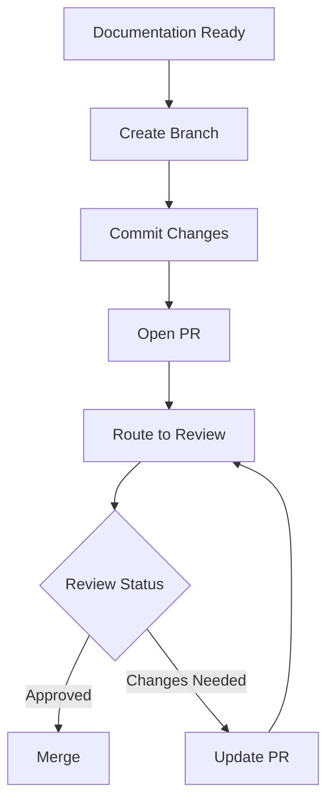

# Pull Request Manager Tool

## PR Creation Flow
1. Receives documentation from ContentGenerator
2. Creates feature branch `docs/update-{timestamp}`
3. Commits documentation files
4. Opens pull request
5. Routes for review

## PR Workflow


## Integration Points
- ContentGenerator: Receives documentation
- ReviewAgent: Routes PRs for review
- BranchManager: Creates doc branches
- CommentManager: Handles review feedback

## PR Structure
```python
PR_TEMPLATE = {
    "title": "docs: update documentation {timestamp}",
    "body": """
# Documentation Update
{summary}

## Changes
{changes}

## Validation
- [x] Technical Review
- [x] Quality Check
- [x] Standards Compliance

## Type
- [x] Documentation
    """,
    "labels": ["documentation", "automated"]
}
```