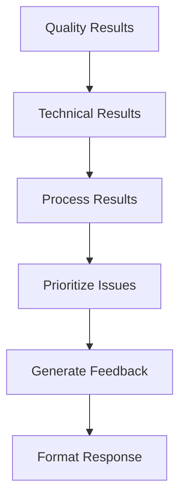

# Feedback Generator Tool

## Feedback Generation Flow


## Feedback Structure
```python
FEEDBACK_TYPES = {
    'technical': {
        'priority': 'high',
        'requires_fix': True,
        'template': 'Technical issue in {location}: {description}'
    },
    'content': {
        'priority': 'medium',
        'requires_fix': False,
        'template': 'Consider improving {section}: {suggestion}'
    }
}
```

## Integration Points
- QualityAnalyzer: Gets quality metrics
- TechnicalValidator: Gets technical issues
- Documentation Agent: Sends structured feedback

## Sample Feedback
```json
{
  "feedback_items": [
    {
      "type": "technical",
      "severity": "high",
      "location": {
        "file": "setup.md",
        "section": "Configuration"
      },
      "description": "Invalid environment variables",
      "suggestion": "Update to match current config schema",
      "requires_fix": true
    }
  ],
  "summary": "3 issues require attention",
  "quality_score": 0.82
}
```