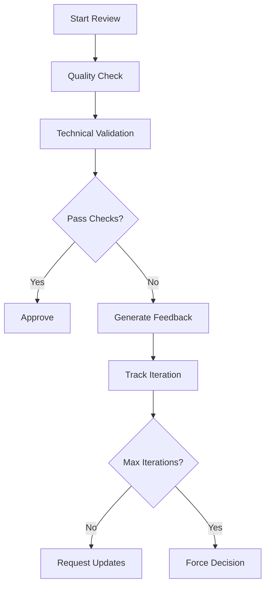

# Review Coordinator Tool

## Review Cycle Flow


## Review Session Management
```python
class ReviewSession:
    def __init__(self, doc_id: str):
        self.max_iterations = 3
        self.min_quality_score = 0.85
        self.current_iteration = 0
        
    async def process_iteration(self, content: Dict) -> ReviewResult:
        self.current_iteration += 1
        quality_score = await self.analyze_quality(content)
        
        if quality_score >= self.min_quality_score:
            return ReviewResult(approved=True)
            
        if self.current_iteration >= self.max_iterations:
            return ReviewResult(
                approved=False,
                reason="Max iterations reached"
            )
            
        return await self.generate_feedback(content)
```

## Integration Points
- QualityAnalyzer: Quality metrics
- FeedbackGenerator: Review feedback
- Documentation Agent: Review status
- GitHub Agent: PR status updates

## Review Status
```json
{
  "review_id": "r123",
  "status": "in_progress",
  "iterations": 2,
  "current_score": 0.83,
  "required_score": 0.85,
  "remaining_iterations": 1,
  "pending_feedback": [
    {
      "type": "content",
      "status": "open"
    }
  ]
}
```