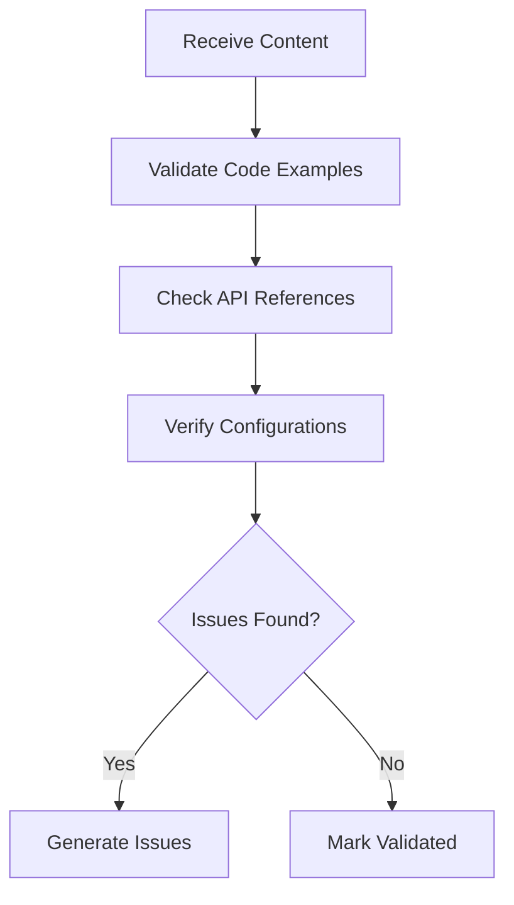

# Technical Validator Tool

## Validation Flow


## Code Validation
```python
def validate_code(examples: List[Dict[str, str]]) -> ValidationResult:
    results = []
    for example in examples:
        validation = {
            "syntax": validate_syntax(example.code),
            "imports": check_imports(example.code),
            "style": check_style(example.code),
            "output": verify_output(example.code, example.expected_output)
        }
        results.append(validation)
    return aggregate_results(results)
```

## Integration Points
- QualityAnalyzer: Provides technical scores
- FeedbackGenerator: Technical issue reports
- Documentation Agent: Validation results

## Validation Output
```json
{
  "validation_status": "failed",
  "issues": [
    {
      "type": "code_example",
      "file": "api.md",
      "location": "Authentication Example",
      "issue": "Invalid API token format",
      "suggestion": "Update to current token format"
    }
  ]
}
```